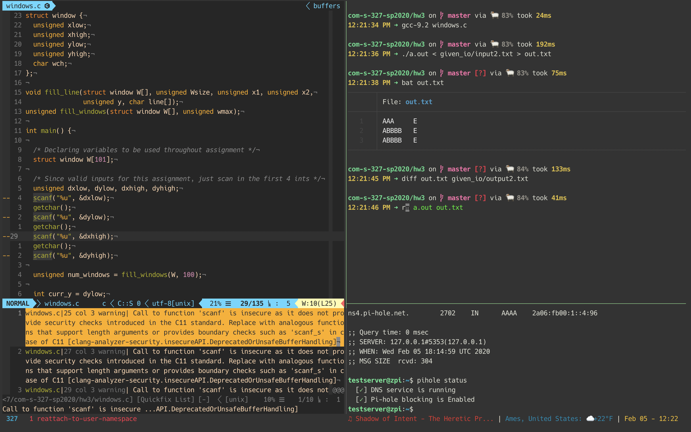

# Zach Gorman's Dotfiles

I've put way more time and effort into these than I care to admit, but here they
are in all their glory (or shame).

Written on and for macOS using iTerm2, but I'm slowly these language agnostic
so I can run the same config on my Arch Linux machine.

## Inspired By

If you like any of these, you'll love where I copied a majority of them from.
This is also the reason my files are split unorthodoxly between `.zshrc`,
`.aliases`, and `.zfunctions`. In my opinion this set up looks better than
cramming everything into `.zshrc`, and also allows for easier navigation via
aliases to exactly what I want to edit. Acknowledgments can be found throughout
the files, but most of them reference:

- [alichtman/dotfiles](https://github.com/alichtman/dotfiles)
