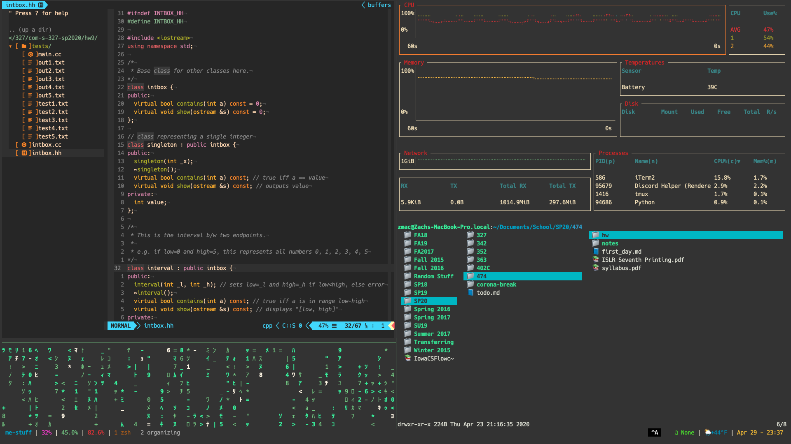
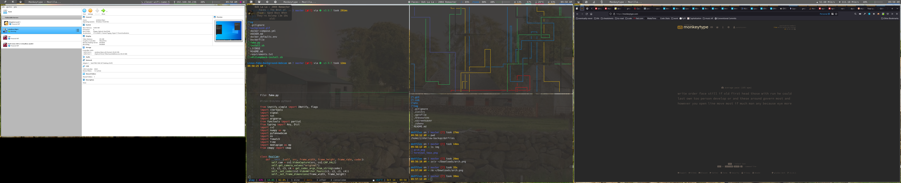

# Zach Gorman's Dotfiles

I've put way more time and effort into these than I care to admit, but here they
are in all their glory (or shame).

## macOS

## Arch

Written on and for both macOS using iTerm2, and Arch Linux (btw) using
[Luke Smith's fork of st](https://github.com/LukeSmithxyz/st)

## Inspired By

If you like any of these, you'll love where I copied a majority of them from.
Acknowledgments can be found throughout the files, but most of them reference:

- [alichtman/dotfiles](https://github.com/alichtman/dotfiles)
- [lukesmithxyz/voidrice](https://github.com/LukeSmithxyz/voidrice)
